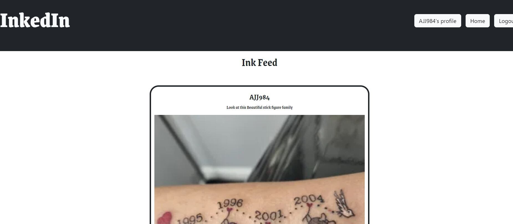
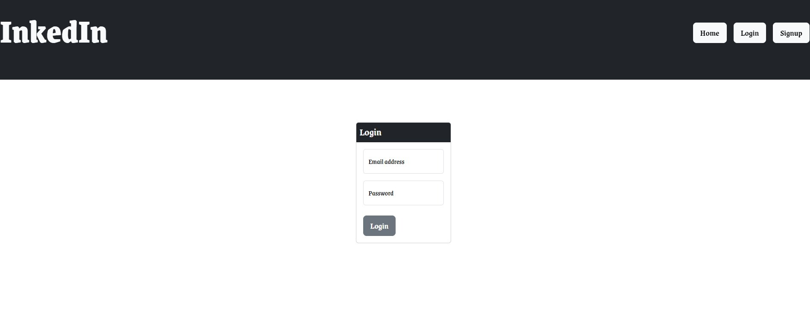

# InkedIn

## Description

Our motivation for this project was to build a MERN-based social media platform where tattoo artists and enthusiasts can share their work and ideas with each other.

## Table of Contents

- [Installation](#installation)
- [Usage](#usage)
- [Links](#links)
- [License](#license)
- [Questions](#questions)

## Installation

Download the .zip file or clone the repository into your source-code editor. Navigate to the repository in your terminal and enter "npm i" to install the required dependencies.

## Usage

1. Start the application by running "npm run develop" in the terminal. It should open in your web browser.
2. Once the application is running in your web browser, click the Signup button to create a user profile.
3. Post your sick tats!

Homepage:  

Login Page: 

## Links

GitHub Repository: https://github.com/bnadel4/inkedin

Heroku Deployed Application: https://inkedin-ef5cc989f602.herokuapp.com/

## License

This application is covered under the MIT License. For more information about this license, visit https://opensource.org/license/mit/.

## Questions

### If you have any questions regarding this project, you can reach the authors here:

* [https://github.com/hcaffey] (Hayden Caffey)
* [https://github.com/peejd] (P.J. Davidian)
* [https://github.com/AJoelj84] (Adam Johnson)
* [https://github.com/bnadel4] (Jamie Nadel)
* [https://github.com/jonparker1221] (Jon Parker)